# Como Fazer um Tsuru de Papel (Origami)

O **Tsuru** é um dos origamis mais tradicionais e simbólicos do Japão. Representa **paz**, **longevidade** e **esperança**. Este tutorial vai te guiar passo a passo para dobrar o seu próprio tsuru usando apenas uma folha quadrada de papel.

## Materiais Necessários

- 1 folha de papel **quadrado** (preferencialmente 15cm x 15cm)
- Superfície plana

> Dica: Use papel próprio para origami ou qualquer folha fina que dobre bem.
 
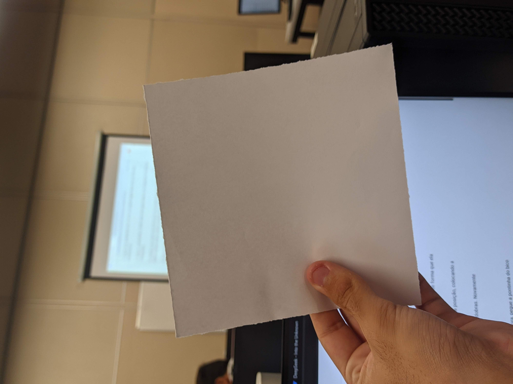

---

## Passo a Passo

### 1. Dobre em X
- Dobre o papel ao meio na diagonal (formando um triângulo), vinque e desdobre.
- Repita na outra diagonal.

### 2. Dobre em cruz
- Dobre ao meio horizontalmente e desdobre.
- Dobre ao meio verticalmente e desdobre.

Você deve ter um padrão de vinco em forma de asterisco `*`.

### 3. Forme o quadrado base
- Pegue os quatro cantos e junte-os ao centro. Isso deve formar um quadrado com duas abas para cada lado (conhecido como **base preliminar**).

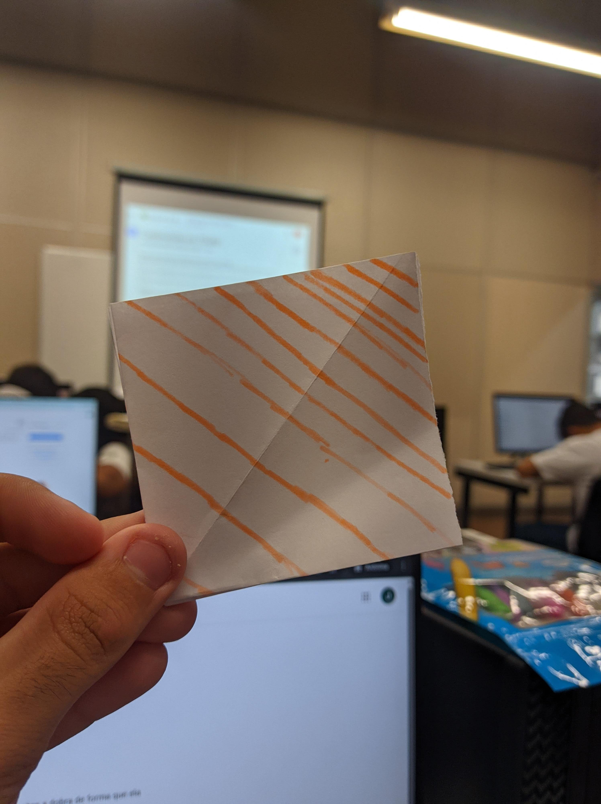

### 4. Forme o diamante
- Com o vértice fechado apontando para você, dobre as laterais ao centro formando um **pipa**.
- Dobre a aba superior para baixo para marcar o vinco e desdobre tudo.
- Abra a aba inferior e dobre para cima, usando os vincos para formar um **diamante**.
- Vire o papel e repita do outro lado.
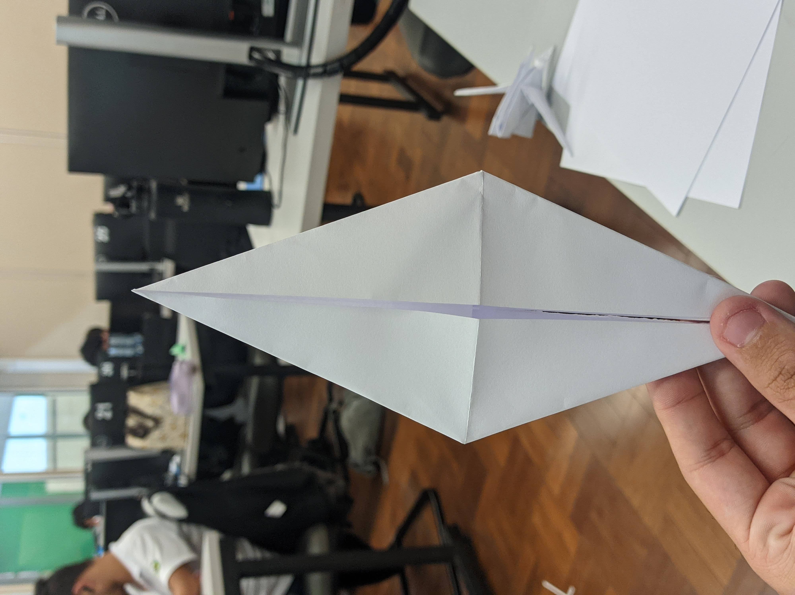

### 5. Forme a base do tsuru
- Dobre as abas laterais do diamante para o centro (em ambos os lados).
- Levante uma aba inferior e dobre-a para cima (isso será o **pescoço** ou **rabo**).
- Repita com a outra aba inferior.
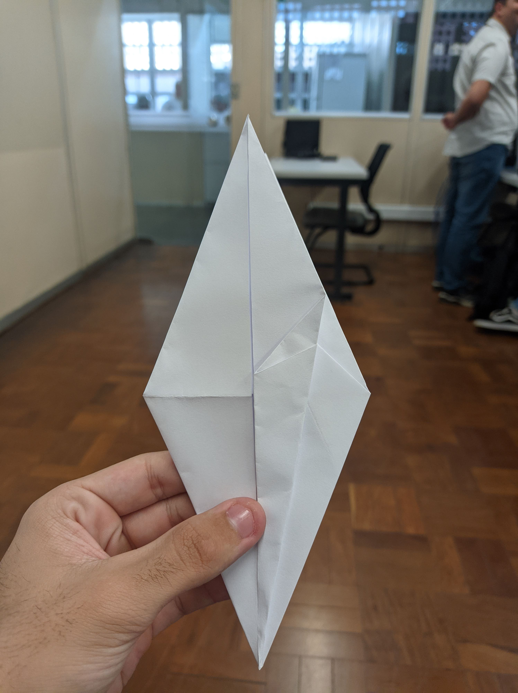
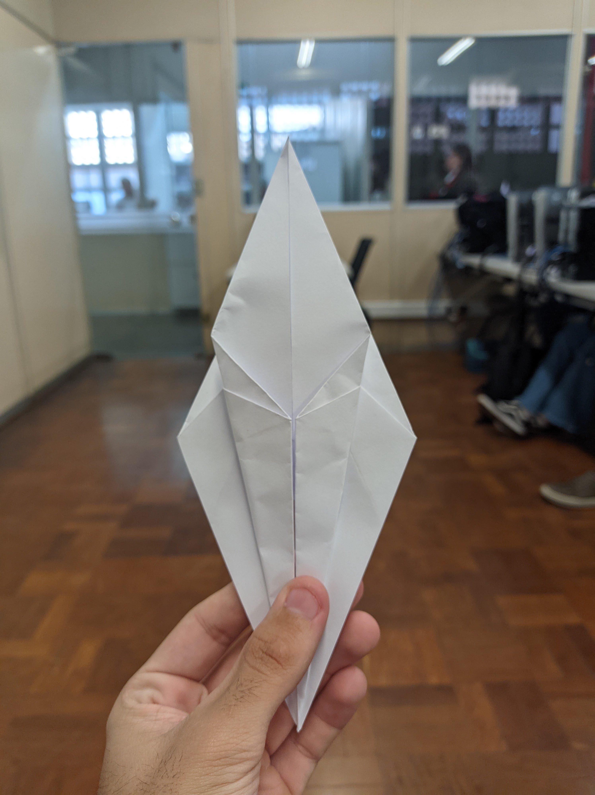
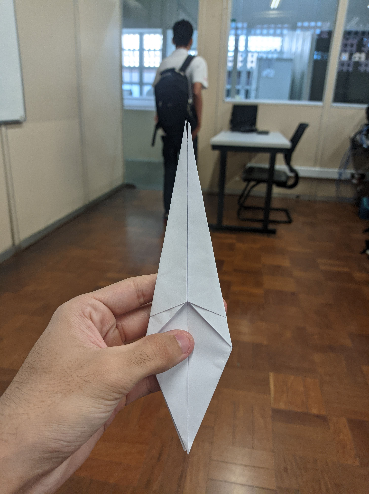
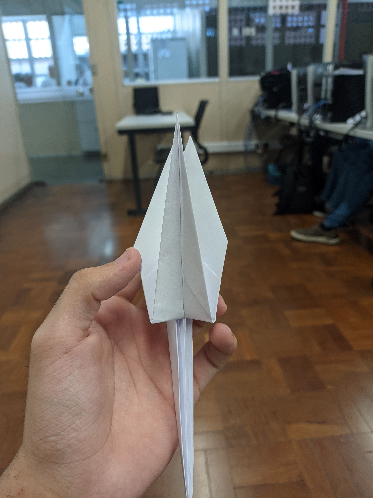
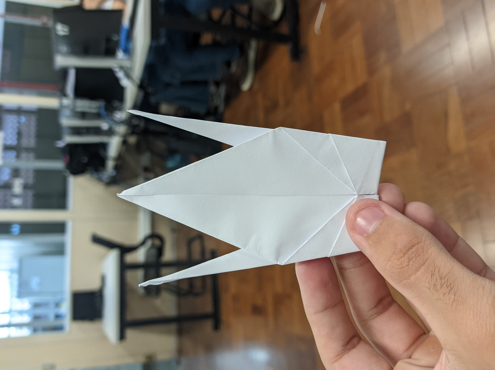

### 6. Forme o corpo
- Puxe cuidadosamente as "asas" para os lados, e o corpo do tsuru vai inflar levemente.
- Dobre a ponta do pescoço para baixo para formar a **cabeça**.
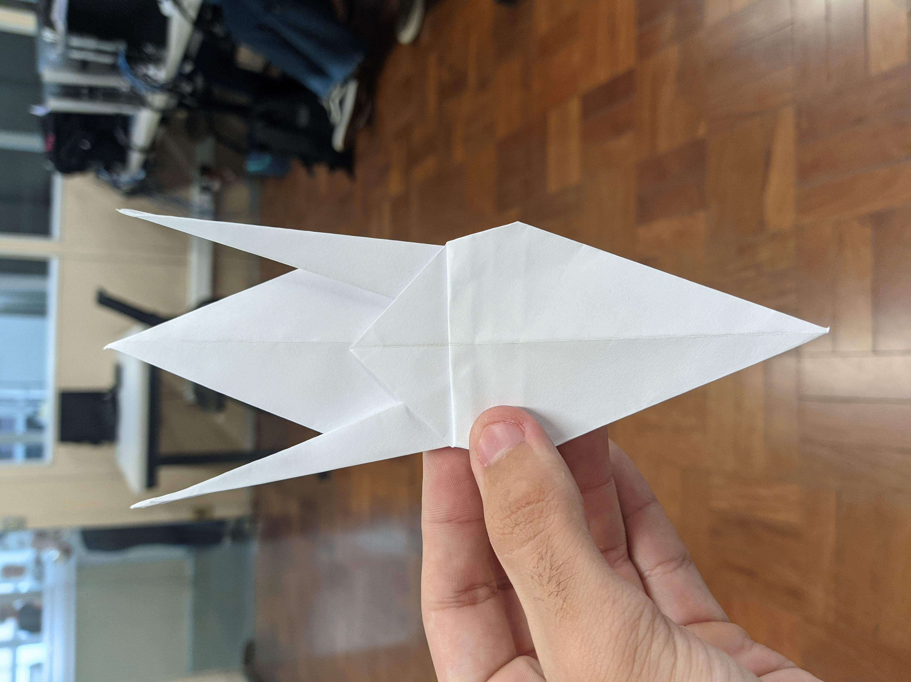
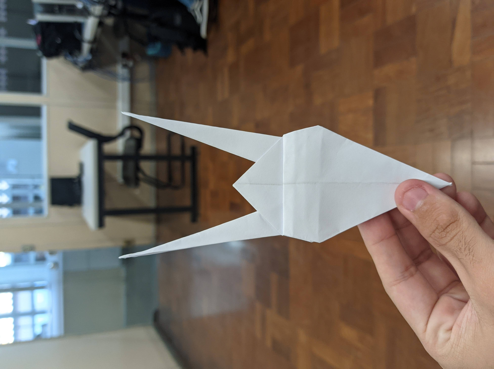
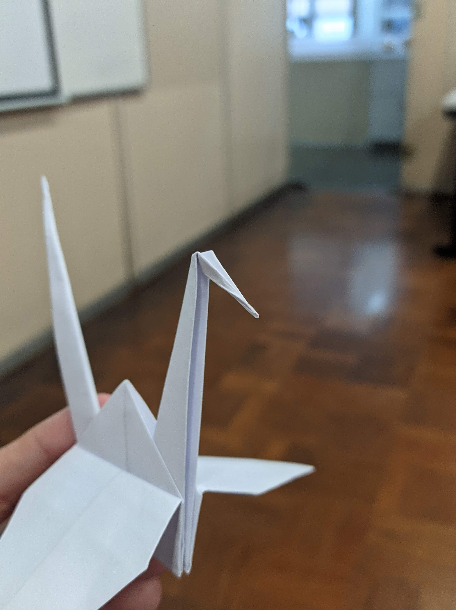

---

## Resultado

Seu tsuru de papel está pronto! 🕊️

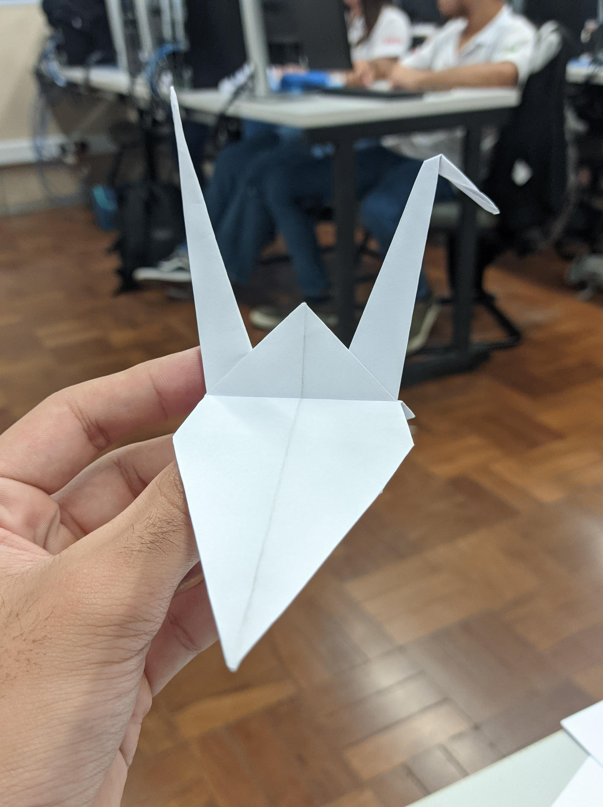

---

## Curiosidades

- Diz a lenda japonesa que quem dobrar **mil tsurus** terá um desejo realizado.
- Tsurus são frequentemente oferecidos como símbolo de paz, especialmente em memoriais como o de Hiroshima.

---

## Licença

Este tutorial é de uso livre e pode ser compartilhado e modificado com os devidos créditos. ✨
